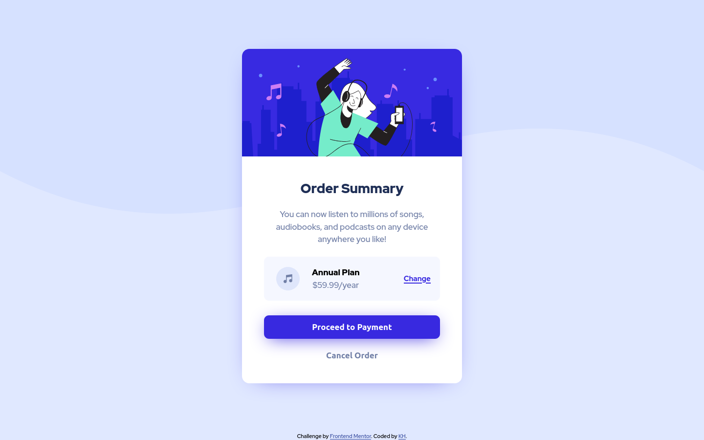

# FM_P3_order_card
Frontend Mentor - Order summary component

This is a solution to the [Order summary card challenge on Frontend Mentor](https://www.frontendmentor.io/challenges/order-summary-component-QlPmajDUj). Frontend Mentor challenges help you improve your coding skills by building realistic projects. 

## Table of contents

- [Overview](#overview)
  - [Screenshot](#screenshot)
  - [Links](#links)
- [My process](#my-process)
  - [Built with](#built-with)

## Overview

### Screenshot

### Links
- Solution URL: https://github.com/khejm/FM_P3_order_card.git
- Live Site URL: https://khejm.github.io/FM_P3_order_card/

## My process

### Built with

- Semantic HTML5 markup
- CSS custom properties
- Flexbox
